<div align="center">

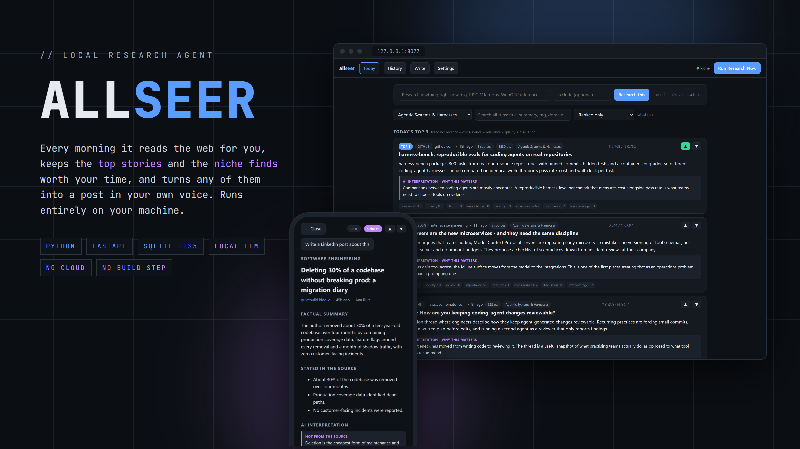

# allseer

**A fully local research agent for the stuff you're supposed to keep up with.**<br>
Every morning it reads the web, keeps **today's top 3** and **the niche finds worth your time**,
and tells you which parts are fact and which are the model's opinion.


</div>

---

## Why it exists

Keeping up with a field usually means one of two things. You doom-scroll five feeds and
come away with the same headline five times, or you pay for a cloud tool that summarises
everything and doesn't say which part it made up.

allseer does the reading on your own machine. For each topic you configure it searches
Hacker News, GitHub, arXiv, RSS feeds and the open web, throws away the stale, the
off-topic and the SEO junk *before* any inference happens, and has a local LLM judge
what's left. You get two short lists, **trending** and **niche**, and each pick comes with
a summary limited to what the source says, the claims it actually makes, and a clearly
labelled opinion on why it matters.

When something is worth sharing, the **Write** tab turns it into a LinkedIn post in your
own voice, and lints the draft for the phrases that make posts read as AI-written.

<div align="center">
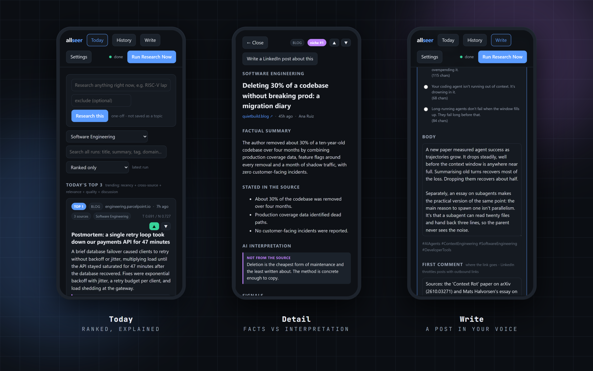
</div>

---

## Key strengths

### 🎯 Two short lists instead of a feed
- **Today's Top 3** ranks on recency, coverage across independent sources, relevance,
  source quality and discussion. Five reprints of one press release count as **one** source.
- **Niche finds** ranks on novelty, depth, importance and *low* coverage, so it surfaces the
  small repo or the one-person blog post you'd never have found, rather than the same
  headline again.
- **Every score is shown.** Each card lists its signals (`relevance 9.0 · novelty 8.0 ·
  cross source 6.7 …`), so you can see why something ranked where it did.
- **No list belongs to one site.** One domain gets one slot per list, and the
  fetch-and-judge budget is shared round-robin across providers, then across domains.

### 🧪 Facts and opinion are kept apart
Each pick separates what the source says from what the model thinks:

| Section | Where it comes from |
|---|---|
| **Factual summary** | Only the fetched page text |
| **Stated in the source** | Specific claims pulled from the page |
| **AI interpretation** | The model's opinion, labelled *not from the source* |
| **Analyst note** | What it is / why it matters / what to check next / **confidence**, for the shortlist only |

### 🧹 Cheap filters before expensive inference
Inference is the slow part, so the cheap filters run first and each one logs how much it dropped:
junk hosts (social, Q&A, course mills), bare site roots, anything outside the freshness window
(checked again after the fetch, when undated items show their real date), per-topic exclusions
matched on word boundaries, and results with fewer than two distinct topic keywords. Extracted
page text is **cached for 14 days**, so pages read in earlier runs aren't downloaded again.

### 👍 Learns from two buttons
Thumbs up or down on any card. Votes are keyed by **link, not run**, and on the next run they:
- shift a domain's pre-filter score by a capped `tanh(net / 3)`, so the thirtieth downvote
  can't outweigh recency, relevance and coverage put together,
- **ban a domain** outright once its net score reaches −3,
- give the judge your five latest likes and dislikes as examples, the only part of its
  prompt that's about you rather than generic.

### ✍️ Write: a LinkedIn post in your own voice
- **Nine angles** (Signal, Discovery, Field notes, Teardown, Contrarian, Thought-provoker,
  Ask the room, Lesson, and **Synthesis**, which links 2+ finds into one pattern).
- **Three hooks** to choose from, an editable body, hashtags, and a **first comment** for the
  link, since LinkedIn shows posts with outbound links to fewer people.
- **Your author profile** (role, audience, voice, a paragraph of your own writing, phrases
  you never use) goes into every prompt. Strict rules: no invented numbers, no claiming
  you used something unless your take says so.
- **A lint pass** flags clichés, emoji, overlong hooks, hashtag spam, bait questions and
  walls of text as amber chips. It never blocks you.

### 🔎 Every run stays searchable
- **SQLite FTS5** across every run's titles, summaries, tags and domains, with prefix
  matching as you type. Typed text is quoted token by token, so `c++` or a stray quote can't
  break the query.
- **History** shows how long each run spent on each stage (`judge 7.5m · fetch 1.9m · 23 cached`),
  so you know whether to tune the model or the network.
- **A markdown digest** of each run is written to `digests/`. You can read it on a phone or
  grep it from a shell, and it outlasts the database.

### 🏠 Local, keyless, and hard to break
| Provider | Source | Key |
|---|---|---|
| `hn` | Hacker News (Algolia) | none |
| `github` | Repo search, `created:>` so only genuinely new repos match | none |
| `arxiv` | arXiv Atom API | none |
| `rss` | Any feeds you list, fetched once per run and filtered locally | none |
| `searxng` | Your own SearXNG instance, i.e. the open web | none |

Topics can **pin their own feeds and providers**. The built-in job-hunt topic uses job boards
only, so they never answer a devlog query. **One error doesn't kill a run.** 403s, paywalls,
pages that need JavaScript, a model returning bad JSON, or an LLM server that's down all get
logged, and the run carries on with what it has. **Stop** cancels a run straight away and keeps
whatever was already stored.

### ⚙️ Engineering that stays small
- **Four runtime dependencies:** FastAPI, uvicorn, httpx, trafilatura. Storage is the
  standard library's `sqlite3`.
- **The whole dashboard is one HTML file** of plain JS. No framework, no bundler, no build step.
- **Any OpenAI-compatible server works:** llama.cpp's `llama-server` or Ollama, with an
  optional bigger `analysis_model` for judging.
- **45 core checks** that need no network and no LLM: `python tests/test_core.py`.
- About 4.5k lines in total.

---

## Screenshots

| Today: ranked and explained | Detail: facts vs interpretation |
|---|---|
| 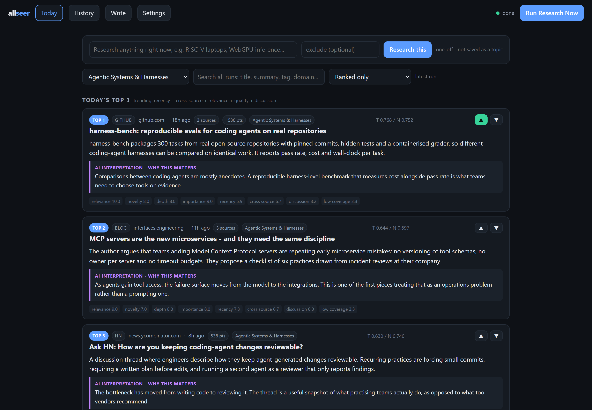 | 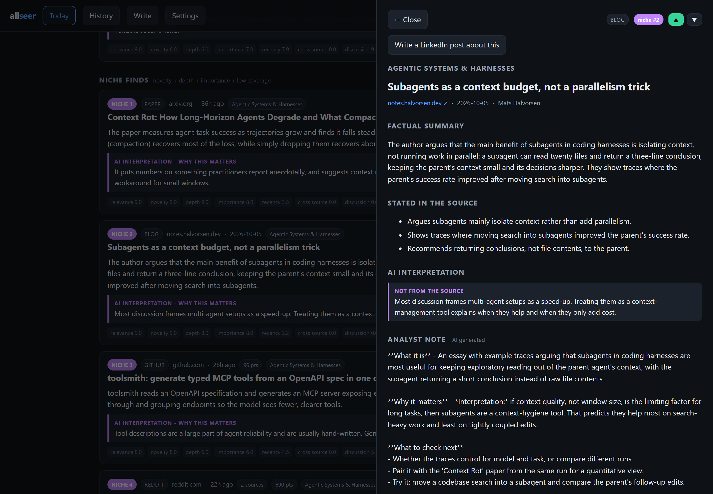 |
| **A run in progress** | **Search across every run** |
| 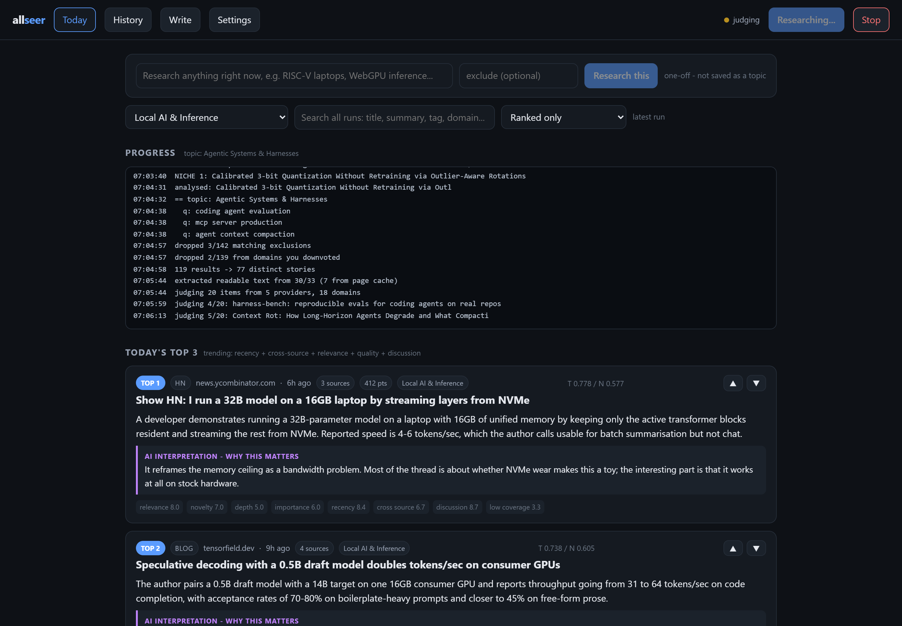 | 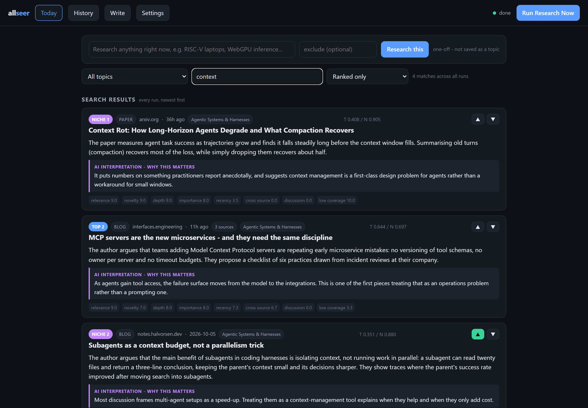 |
| **Write: a synthesis draft** | **History with stage timings** |
| 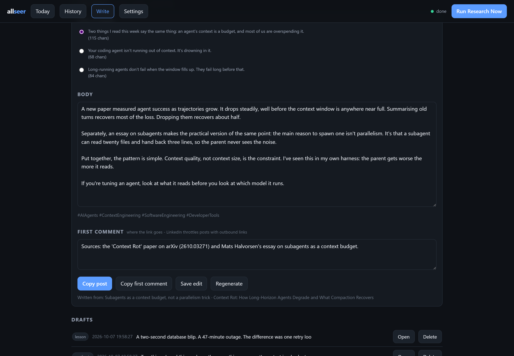 | 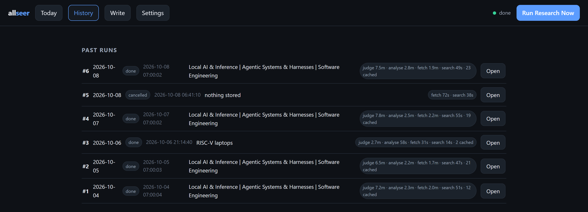 |

<details>
<summary>More: light mode and settings</summary>

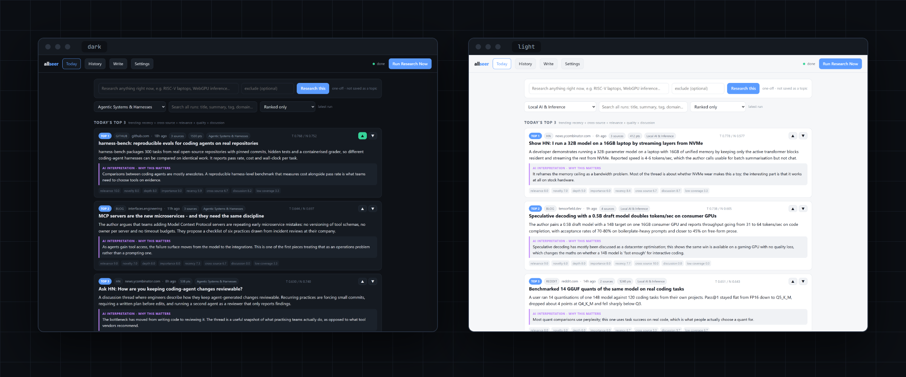

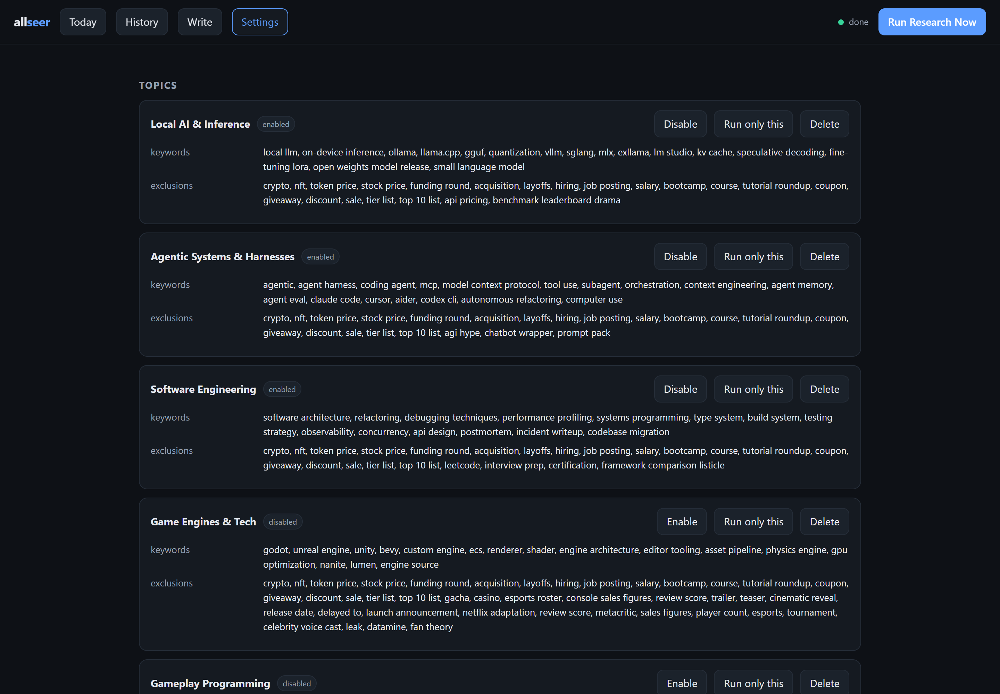

</details>

---

## How the ranking works

Fixed rules in Python handle everything they can. The LLM is only asked for judgement calls
(relevance, novelty, depth, importance) as numbers from 0 to 10.

| List | Formula |
|---|---|
| **Pre-filter** *(who gets fetched and judged)* | 0.30 topic match + 0.25 recency + 0.15 cross-source + 0.15 source quality + 0.10 discussion + 0.05 has text ± 0.15 vote bias |
| **Trending** | 0.25 recency + 0.25 cross-source + 0.25 relevance + 0.10 source quality + 0.15 discussion |
| **Niche** | 0.25 novelty + 0.25 depth + 0.15 relevance + 0.15 importance + 0.20 *low* coverage |

Recency has a 24-hour half-life, and an unknown date counts as about three days old, never as
fresh. Niche penalises big aggregators and pages too thin to show any depth. An item never
appears in both lists. The weights live in [`allseer/rank.py`](allseer/rank.py).

---

## Architecture

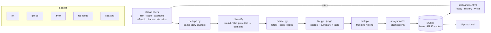

| Path | Role |
|---|---|
| `allseer/pipeline.py` | One run from start to finish, with stage timings and cancellation |
| `allseer/providers.py` | Search providers and the junk-host list. Add a provider here |
| `allseer/rank.py` | Freshness, topic and exclusion filters, the scoring formulas, list selection |
| `allseer/llm.py` | OpenAI-compatible client, the four prompts, post angles, draft lint |
| `allseer/dedupe.py` | URL canonicalisation and same-story clustering |
| `allseer/extract.py` | Page fetch and readable-text extraction |
| `allseer/db.py` | Schema, settings, votes, page cache, FTS helpers, drafts |
| `allseer/app.py` | FastAPI JSON API that also serves the dashboard |
| `static/index.html` | The whole UI |

---

## Getting started

```powershell
# 1. A local LLM server that speaks the OpenAI chat API. Either works:
#    llama.cpp: edit the paths in llama.ps1, then
powershell -ExecutionPolicy Bypass -File .\llama.ps1      # serves on :8081
#    Ollama: install, pull a model, set llm_url = http://localhost:11434 in Settings

# 2. Install and run
python -m pip install -r requirements.txt
python run.py                                             # http://127.0.0.1:8077
```

Open the dashboard and press **Run Research Now**, or type any subject into **Research this**
for a one-off run that isn't saved as a topic.

```powershell
python run.py --reload    # restart on every code edit
python run.py --once      # one headless run, then exit
python run.py --port 9000
```

**A morning dossier every day:** point Task Scheduler at `--once`.

```powershell
schtasks /create /tn allseer /tr "python C:\path\to\allseer\run.py --once" /sc daily /st 07:00
```

**SearXNG (optional)** adds the open web. Set `searxng_url`, and turn on the JSON API in the
instance's `settings.yml` (`search.formats: [html, json]`), because it's off by default.

The most important settings:

| Setting | What it does |
|---|---|
| `llm_url`, `llm_model` | Your local LLM server and model |
| `analysis_model` | A bigger model just for judging and analyst notes (blank = same model) |
| `max_llm` | Items judged per topic. **Run time depends mostly on this** |
| `days_back` | Hard freshness window. Anything older is dropped before ranking |
| `suppress_seen_days` | Don't show links already picked within this many days |
| `persona_*` | Your author profile for the Write tab. `persona_sample` matters most |

The full list, and the reasoning behind each filter and weight, is in
[`docs/DESIGN.md`](docs/DESIGN.md).

---

## Deliberately not built

- **No cloud fallback.** If the LLM is down you still get the searched, deduplicated,
  unscored results under *Everything discovered*, but nothing leaves the machine.
- **No LinkedIn or Reddit search provider.** LinkedIn has no public feed and blocks
  fetches without a login. Reddit search stops answering after about one anonymous request,
  so subreddits come in through their RSS feeds instead.
- **No auto-posting.** The Write tab copies to your clipboard. You choose what gets published.

---

## License

[MIT](LICENSE) © 2026 Md. Nurusshafi Evan
